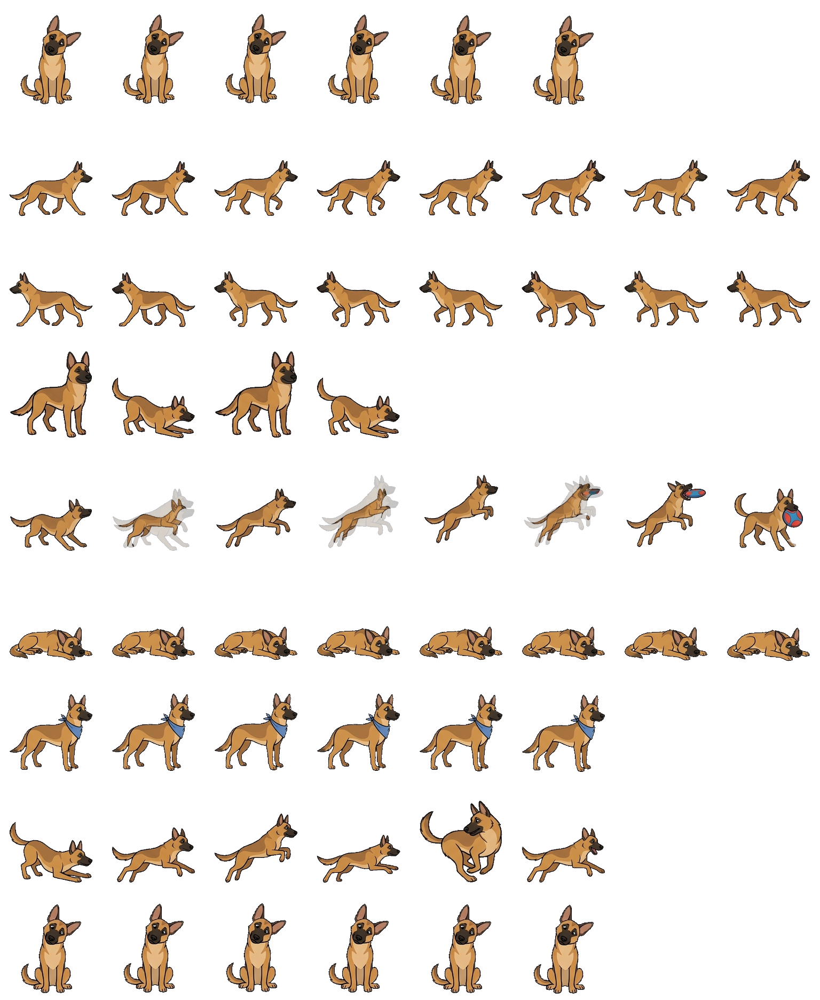

# NeoClaude

A desk companion that runs an animated pixel pet on a tiny AMOLED screen and lets you approve or deny [Claude Code](https://docs.anthropic.com/en/docs/claude-code) permission prompts with physical buttons.

When Claude Code wants to run a command, edit a file, or do anything that needs your approval, the request shows up on the device. Press the side button to approve or the power button to deny. The pet goes back to its idle animation when you're done.

If the device is off or disconnected, Claude Code falls back to the normal terminal prompt. Zero disruption.

## Hardware

You need one board and one cable:

| Part | Price | Where to Buy |
|------|-------|--------------|
| Waveshare ESP32-S3-Touch-AMOLED-1.8 | ~$25 | [Waveshare](https://www.waveshare.com/esp32-s3-touch-amoled-1.8.htm), [Amazon](https://www.amazon.com/dp/B0DHT57VW7) |
| USB-C cable (data-capable) | ~$5 | Any USB-C cable that supports data transfer, not just charging |

The board includes everything: a 368x448 AMOLED display, capacitive touchscreen, WiFi, 8MB PSRAM, 16MB flash, two physical buttons, and a USB-C port for power and flashing. No soldering, no case, no battery required.

> **Important:** Make sure you get the **1.8-inch** version (ESP32-S3-Touch-AMOLED-1.8). Waveshare makes several AMOLED boards with different sizes and resolutions. The firmware is built specifically for this model's display controller (SH8601) and pin layout.

## How It Works

```
Claude Code              Your Mac                    ESP32
    |                       |                          |
    |-- permission needed --|                          |
    |                       |-- bridge script ---------|
    |                       |   (curl POST)            |
    |                       |                          |-- show prompt on screen
    |                       |                          |-- wait for button press
    |                       |                          |-- respond allow/deny
    |                       |<---- JSON response ------|
    |<-- decision ----------|                          |
    |                       |                          |-- resume pet animation
```

The bridge script is a simple curl wrapper that Claude Code calls via its [hook system](https://docs.anthropic.com/en/docs/claude-code/hooks). If the ESP32 is unreachable, the script exits silently and Claude Code shows the normal terminal prompt.

## Setup

### 1. Get a sprite sheet

Any 1536x1872 sprite sheet with an 8-column x 9-row grid of 192x208 frames will work. An example is included in the repo:



**Where to find sprite sheets:**
- Use the included `examples/example-spritesheet.png` to get started
- [itch.io](https://itch.io) has thousands of free/paid pixel art sprite sheets (search "pixel pet" or "pixel character")
- [OpenGameArt.org](https://opengameart.org) has free, open-licensed sprite art
- Draw your own with [Piskel](https://www.piskelapp.com/) or [Aseprite](https://www.aseprite.org/)
- Generate one with an AI image tool (Gemini, etc.) using the sprite sheet format below

The sprite sheet must be a grid of 8 columns and 9 rows, where each cell is 192x208 pixels. Each row is one animation (idle, run, wave, etc.). See the [animation layout](#animation-layout) table below.

### 2. Convert the sprite sheet

```bash
pip3 install Pillow numpy
python3 tools/convert_sprites.py path/to/spritesheet.png data/a --name "My Pet"
```

This slices the sheet into individual RGB565 binary frames. You can load up to two pets (the 12.9MB data partition fits about 9MB of sprites):

```bash
python3 tools/convert_sprites.py pet1/spritesheet.png data/a --name "Pet One"
python3 tools/convert_sprites.py pet2/spritesheet.png data/b --name "Pet Two"
```

If using two pets, update `SPRITE_DIRS` and `SPRITE_NAMES` in `src/main.cpp` to match your output directory names. Tap the top of the screen to switch between them.

### 3. Install PlatformIO

```bash
brew install platformio
```

Or install the [PlatformIO IDE extension](https://platformio.org/install/ide) for VS Code.

### 4. Configure WiFi

```bash
cp include/wifi_config.h.example include/wifi_config.h
```

Edit `include/wifi_config.h` with your WiFi network name and password. This file is gitignored.

### 5. Flash the firmware

Plug in the ESP32 via USB-C, then:

```bash
pio run -t uploadfs    # upload sprite data
pio run -t upload      # upload firmware
```

The device should boot, connect to WiFi, and start animating. Check the serial monitor (`pio device monitor`) to see the assigned IP address.

### 6. Set up the bridge script

Create `~/bin/neoclaude-permission.sh`:

```bash
#!/bin/bash
NEOCLAUDE_URL="http://YOUR_ESP32_IP/permission"

input=$(cat)

response=$(echo "$input" | curl -s \
    --max-time 35 \
    --connect-timeout 5 \
    -X POST \
    -H "Content-Type: application/json" \
    -d @- \
    "$NEOCLAUDE_URL" 2>/dev/null)

exit_code=$?

if [ $exit_code -ne 0 ] || [ -z "$response" ]; then
    exit 0
fi

echo "$response"
```

```bash
chmod +x ~/bin/neoclaude-permission.sh
```

Replace `YOUR_ESP32_IP` with the IP from step 5. For reliability, set a static DHCP reservation on your router.

### 7. Configure Claude Code

Add the hook to your Claude Code settings. Open your project's `.claude/settings.local.json` (or `~/.claude/settings.json` for global) and add:

```json
{
  "hooks": {
    "PermissionRequest": [
      {
        "hooks": [
          {
            "type": "command",
            "command": "/path/to/neoclaude-permission.sh",
            "timeout": 40
          }
        ]
      }
    ]
  }
}
```

### 8. Test it

Verify the ESP32 is reachable:

```bash
curl http://YOUR_ESP32_IP/health
```

Then use Claude Code normally. When it needs permission, the prompt will appear on the device.

## Button Mapping

| Input | Action |
|-------|--------|
| Side button | Approve |
| Power button (short press) | Deny |
| Touch screen (left half, bottom) | Approve |
| Touch screen (right half, bottom) | Deny |
| Touch screen (top) | Switch pet (if two loaded) |
| Touch screen (middle) | Cycle animations |

## Animation Layout

The sprite sheet rows map to these animations:

| Row | Animation | Used for |
|-----|-----------|----------|
| 0 | Idle | Default loop |
| 1 | Run right | Idle variety |
| 2 | Run left | Idle variety |
| 3 | Wave | Tap interaction |
| 4 | Jump | Tap interaction |
| 5 | Failed/sad | Tap interaction |
| 6 | Waiting | Tap interaction |
| 7 | Working | Tap interaction |
| 8 | Thinking | Tap interaction |

## Timeout Chain

If nobody presses a button:

1. **5s connect timeout**: ESP32 offline, falls back to terminal prompt
2. **30s device timeout**: No button pressed, ESP32 responds 408
3. **35s curl timeout**: Safety net if ESP32 hangs
4. **40s hook timeout**: Claude Code kills the script, shows terminal prompt

## Troubleshooting

**Can't connect to ESP32**: Check that your computer and the ESP32 are on the same WiFi network and subnet. Use `pio device monitor` to see the ESP32's IP.

**Permission denied before I pressed anything**: Stale button interrupt. The firmware clears these on prompt display, but if it persists, try a firmware re-flash.

**Sprite data too large**: The data partition is 12.9MB. Two pets with ~57 frames each fit. Three will not. Remove a pet's directory from `data/` if needed.

**mDNS not resolving**: Use the IP address directly instead of `neoclaude.local`. mDNS can be flaky on some networks.

## Project Structure

```
src/main.cpp              Firmware: animation, WiFi, HTTP server, permission bridge
include/pin_config.h      Board pin definitions (Waveshare-specific)
include/wifi_config.h     Your WiFi credentials (gitignored)
tools/convert_sprites.py  Sprite sheet to RGB565 converter
examples/                 Example sprite sheet to get started
platformio.ini            PlatformIO build config
partitions.csv            Custom partition table (3MB app, 12.9MB data)
data/                     LittleFS content: converted sprite frames (gitignored)
lib/                      Vendor libraries (Waveshare GFX, XPowersLib, etc.)
```

## License

MIT
